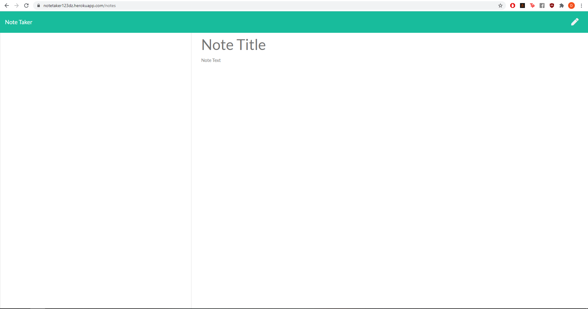

## Description

A fully responsive Express.js web app hosted on heroku that allows users to create notes to help organise thoughts and planning. Notes are saved for review at a later date or can be deleted.

## Installation

1. Fork GitHub repo and clone to your chosen directory.
2. Type the following into console

- `npm install`
- `node index.js`

## Deployed Link

https://notetaker123dz.herokuapp.com/

## Usage

To create notes for personal use

## Screenshot

